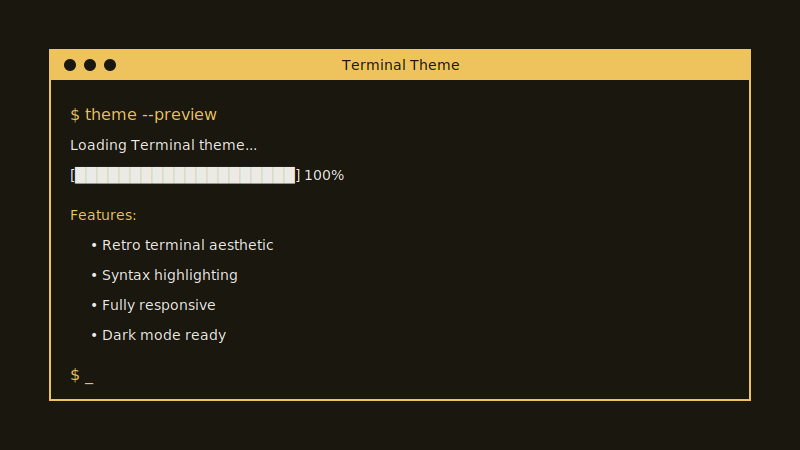

# Terminal Theme Next.js

基于 **Next.js 15** 的复古终端风博客主题，支持 **MDX**，命令行式视觉。本项目将经典的 Hugo Terminal 主题体验带到 React 生态，并加入现代工程实践。

> 英文说明见 [README.md](./README.md)



## ✨ 功能特性

- 🖥️ **终端风格界面** — 复古命令行观感，可自定义配色
- 📝 **MDX 支持** — 用 MDX 写作，可嵌入 React 组件
- 🎨 **语法高亮** — 多语言代码块
- 📱 **响应式布局** — 适配桌面、平板与手机
- ⚡ **性能** — Next.js 15 + React 19
- 🔍 **SEO** — 合理的 meta 与结构化内容
- 🌙 **终端配色变量** — 灵感来自经典终端模拟器
- 🚀 **现代技术栈** — TypeScript、Tailwind CSS 等

## 🏗️ 项目结构

```
terminal-theme-nextjs/
├── content/
│   └── posts/                 # MDX 博文
│       ├── hello_world.mdx
│       └── showcase.mdx
├── public/
│   ├── fonts/                 # Fira Code 字体
│   └── *.svg                  # 静态资源与图标
├── src/
│   ├── app/                   # Next.js App Router
│   │   ├── about/             # 关于页
│   │   ├── posts/             # 动态文章路由
│   │   ├── tags/              # 按标签筛选
│   │   ├── globals.css        # 全局样式与终端主题
│   │   ├── layout.tsx         # 根布局
│   │   └── page.tsx           # 首页
│   ├── components/            # 可复用组件
│   │   ├── CodeBlock.tsx      # 语法高亮代码块
│   │   ├── Header.tsx         # 终端风导航
│   │   ├── Footer.tsx         # 页脚
│   │   ├── MDXContent.tsx     # MDX 渲染
│   │   ├── PostCard.tsx       # 文章卡片
│   │   └── *.tsx              # 其他 UI
│   └── lib/                   # 工具与类型
│       ├── posts.ts           # 文章读取等
│       └── types.ts           # TypeScript 类型
├── mdx-components.tsx         # 全局 MDX 组件映射
├── next.config.ts             # Next.js 配置
└── package.json               # 依赖与脚本
```

## 🛠️ 技术栈

### 核心框架

- **[Next.js 15](https://nextjs.org/)** — App Router
- **[React 19](https://react.dev/)** — React 最新大版本
- **[TypeScript](https://www.typescriptlang.org/)** — 类型安全

### 内容与样式

- **[MDX](https://mdxjs.com/)** — Markdown + React
- **[next-mdx-remote](https://github.com/hashicorp/next-mdx-remote)** — 服务端 MDX 渲染
- **[Tailwind CSS 4](https://tailwindcss.com/)** — 工具类 CSS
- **[Fira Code](https://github.com/tonsky/FiraCode)** — 等宽字体与连字

### 内容处理

- **[gray-matter](https://github.com/jonschlinkert/gray-matter)** — Front matter 解析
- **[remark](https://remark.js.org/)** — Markdown 处理
- **[rehype](https://rehype.js.org/)** — HTML 处理
- **[rehype-highlight](https://github.com/rehypejs/rehype-highlight)** — 语法高亮

### 工具库

- **[date-fns](https://date-fns.org/)** — 日期处理
- **[reading-time](https://github.com/ngryman/reading-time)** — 阅读时长估算
- **[lucide-react](https://lucide.dev/)** — 图标
- **[clsx](https://github.com/lukeed/clsx)** — 条件 class

## 🚀 快速开始

### 环境要求

- Node.js 18+
- npm、yarn、pnpm 或 bun

### 安装与运行

1. **克隆仓库**

   ```bash
   git clone https://github.com/CharryLee0426/terminal-theme-nextjs.git
   cd terminal-theme-nextjs
   ```

2. **安装依赖**

   ```bash
   npm install
   # 或
   yarn install
   # 或
   pnpm install
   ```

3. **启动开发服务器**

   ```bash
   npm run dev
   # 或
   yarn dev
   # 或
   pnpm dev
   ```

4. **在浏览器中打开** [http://localhost:3000](http://localhost:3000)

## 📝 撰写内容

### 新建文章

在 `content/posts/` 下创建 MDX 文件，例如：

```markdown
---
title: "Your Post Title"
date: "2024-01-15"
description: "A brief description of your post"
tags: ["nextjs", "react", "terminal"]
---

# Your Content Here

You can use **markdown** and React components!

```javascript
console.log("Hello, Terminal!");
```

<Callout type="info">
  This is a custom React component in MDX!
</Callout>
```

### 可用组件

- `<CodeBlock>` — 带复制等能力的代码块
- `<Callout>` — 信息 / 警告 / 错误提示框
- `<CustomImage>` — 图片与说明
- `<YouTubeEmbed>` — 嵌入 YouTube

## 🎨 自定义

### 配色

主题使用 CSS 变量，可在 `src/app/globals.css` 中修改：

```css
:root {
  --accent: #ffa86a;           /* 主强调色 */
  --background: #1d1e20;       /* 背景 */
  --color: #c9c9c9;            /* 正文色 */
  --border-color: rgba(255, 255, 255, 0.1); /* 边框 */
  
  /* 终端色 */
  --terminal-green: #00ff41;
  --terminal-blue: #66d9ef;
  --terminal-yellow: #e6db74;
  /* ... 更多变量 */
}
```

### 添加自定义组件

1. 在 `src/components/` 中编写组件  
2. 在 `mdx-components.tsx` 中导出映射  
3. 在 MDX 正文中使用  

### 修改布局

- **顶栏**：`src/components/Header.tsx`  
- **页脚**：`src/components/Footer.tsx`  
- **全局布局**：`src/app/layout.tsx`  

<a id="convex-auth-and-jwt-keys-dev-and-production"></a>

## Convex 身份验证与 JWT 密钥（开发与生产）

项目使用 **[Convex](https://www.convex.dev/)** 与 **[@convex-dev/auth](https://labs.convex.dev/auth)**（密码登录）。登录成功后，Convex 会签发使用 **RS256** 签名的 **会话 JWT**。密钥对必须配置在 **Convex 部署的环境变量**中，而**不能**只放在 Vercel 或本地 `.env.local` 里。

### 必需的 Convex 变量

| 变量 | 作用 |
|------|------|
| `JWT_PRIVATE_KEY` | PKCS #8 PEM **私钥**，用于 **签发** JWT（务必保密）。 |
| `JWKS` | JSON Web Key Set，包含用于 **校验** 令牌的 **公钥** 材料。 |

若缺少 `JWT_PRIVATE_KEY`，登录会出现类似 `Missing environment variable JWT_PRIVATE_KEY` 的错误。

**不要**在 Convex Cloud 上自行设置 `CONVEX_SITE_URL`：它是部署的**内置**值（你的 `*.convex.site` 地址），JWT 的 `iss` 等声明依赖它。

官方文档：[Convex Auth — manual setup](https://labs.convex.dev/auth/setup/manual)。

### 本地开发

1. 将仓库关联到 Convex 项目（首次执行 `npx convex dev`）。  
2. 生成密钥对并写入**当前链接的部署**（由 `.env.local` 中的 `CONVEX_DEPLOYMENT` 等决定）：

   ```bash
   npm run convex:apply-auth-keys
   ```

   上述命令会执行 `scripts/generate-convex-auth-keys.mjs --apply`，通过 `npx convex env set … --from-file` 设置 `JWT_PRIVATE_KEY` 与 `JWKS`（含空格的 PEM 不能作为单个 shell 参数直接传入）。

3. 若只想**打印**变量值（例如粘贴到 Dashboard），可运行：

   ```bash
   npm run convex:generate-auth-keys
   ```

4. 修改 Convex 环境变量后，请重启 `npx convex dev`。

### 生产环境

Convex 的 **开发** 与 **生产** 是不同部署，必须在 **生产部署** 上也配置 **`JWT_PRIVATE_KEY` 和 `JWKS`**。可以复制开发环境密钥，但更推荐为生产使用**独立密钥对**并做好**轮换**规划。

**方式 A — Convex Dashboard（最简单）**

1. 打开 [Convex Dashboard](https://dashboard.convex.dev) → 选中项目 → 选择 **Production** 部署。  
2. 进入 **Settings → Environment variables**。  
3. 本地执行 `npm run convex:generate-auth-keys`，将输出的：  
   - `JWT_PRIVATE_KEY` — 私钥整段（单行或多行 PEM，Dashboard 一般均支持）；  
   - `JWKS` — `JWKS=` 后的 JSON 原样粘贴。  

**方式 B — Convex CLI 指定生产**

在本地生成 PEM / JSON 文件（**勿提交到 Git**），然后：

```bash
npx convex env set --prod JWT_PRIVATE_KEY --from-file ./jwt-private.pem
npx convex env set --prod JWKS --from-file ./jwks.json
```

若使用命名部署，可将 `--prod` 换成 `--deployment <名称>`。

### Vercel（或其他 Next.js 托管）

在宿主平台配置面向浏览器的 **公开** Convex 地址（可参考 `.env.local`）：

- `NEXT_PUBLIC_CONVEX_URL` — 例如 `https://<deployment>.convex.cloud`  
- `NEXT_PUBLIC_CONVEX_SITE_URL` — 例如 `https://<deployment>.convex.site`  

生产构建应使用 **生产环境** Convex 的 URL。JWT 私钥与 `JWKS` **只**放在 Convex，**不要**做成 `NEXT_PUBLIC_*`。

### 轮换密钥

重新生成并覆盖 `JWT_PRIVATE_KEY` / `JWKS` 会使**已有会话失效**，用户需重新登录，请提前规划。

## 🚀 部署到 Vercel

### 一键部署

[](https://vercel.com/new/clone?repository-url=https://github.com/CharryLee0426/terminal-theme-nextjs)

### 手动部署

1. **推送到 GitHub**

   ```bash
   git add .
   git commit -m "Initial commit"
   git push origin main
   ```

2. **连接 Vercel**

   - 打开 [vercel.com](https://vercel.com)  
   - 导入 GitHub 仓库  
   - 构建选项一般可自动识别  
   - 部署  

3. **环境变量**

   - 为 **生产** Convex 部署配置 `NEXT_PUBLIC_CONVEX_URL` 与 `NEXT_PUBLIC_CONVEX_SITE_URL`（详见上文 [Convex 身份验证与 JWT](#convex-auth-and-jwt-keys-dev-and-production)）。  
   - 在 Convex **生产** 部署上设置 `JWT_PRIVATE_KEY` 与 `JWKS`（同上）。  
   - 修改环境变量后重新部署。  

### 构建说明

- **Framework**：Next.js  
- **Build Command**：`npm run build`  
- **Output Directory**：`.next`  
- **Install Command**：`npm install`  

## 📚 延伸阅读

### Next.js

- [Next.js 文档](https://nextjs.org/docs)  
- [Learn Next.js](https://nextjs.org/learn)  

### MDX

- [MDX 文档](https://mdxjs.com/)  
- [next-mdx-remote](https://github.com/hashicorp/next-mdx-remote)  

## 🤝 参与贡献

欢迎提交 Pull Request。较大改动请先开 Issue 讨论。

1. Fork 本仓库  
2. 新建分支（`git checkout -b feature/AmazingFeature`）  
3. 提交修改（`git commit -m 'Add some AmazingFeature'`）  
4. 推送分支（`git push origin feature/AmazingFeature`）  
5. 发起 Pull Request  

## 📄 许可证

本项目基于 MIT 许可证，详见 [LICENSE](LICENSE)。

## 🙏 致谢

- **[panr/hugo-theme-terminal](https://github.com/panr/hugo-theme-terminal)** — 原版 Hugo Terminal 主题，感谢 [panr](https://github.com/panr)。  
- **[Terminal.css](https://panr.github.io/terminal-css/)** — 配色方案工具  
- 所有为本项目提供依赖与灵感的开源社区  

---

<div align="center">

**[🌟 Star this repo](https://github.com/CharryLee0426/terminal-theme-nextjs)** • **[🐛 Report Bug](https://github.com/CharryLee0426/terminal-theme-nextjs/issues)** • **[💡 Request Feature](https://github.com/CharryLee0426/terminal-theme-nextjs/issues)**

Made with ❤️ by [CharryLee](https://github.com/CharryLee0426)


</div>
